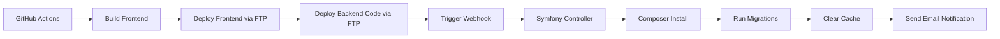

# THIS PROJECT IS AN EXPERIANCE WITH VIBE CODING
I did not write a single line of code, or even docker setup for the dev environment (well, I did one line but the bot was being so stupid and adding 10 files and even .sh files for a one line php fix !!)

I did some reviews just to check the code and then guide the bot after to correct major bugs

I had to help the bot with many console errors, cutting him off and reguiding him before he went haywire. 

note : always test after each change and use git often. And tell the bot never to commit by himself or you will be cherry picking like hell (lil bastard almost crashed the entire project once, thank god for git)

Tools used :
- Lovable: frontend and init of the project
- windsurf with Claude 3.7 and gemini 2.5 pro for most of debugging, construction of the backend and plugging into front end
- google jules mostly to init extra features and then a pass (or 20) with claude and gemini to fix the errors, but easier than repassing via lovable as they don't allow branch creation / changing (I don't like to commit to main on major updates)
- Moved to Cursor and Claude 4 beginning of juin after anthropic shut off windsurf (https://windsurf.com/blog/anthropic-models)

I will add an extra paragraph if I feel up to in at the end of the project to give my full recomendations on each tool and the experience

# CBZ Comic Reader

(yes, even the readme was done by AI !! apart from my little extra just before, after this, all is 100% pure free range computer)

## Project Overview

CBZ Comic Reader is a web application that allows users to read comic books in CBZ format. The application features a secure login system, a comic selection interface, and a reading progress tracker that remembers where you left off.

## Initial Project Requirements

The following prompt was used to initiate this project:

```
I need a front end for my new web app. It will be a comic book reader to read cbz files.
The files will only be accessible when logged in so I will need a landing page to log in first.
Then I will need a select comic section / page to select the comic I want to read, probably taken from the database / backend.
The Database / backend will also know the history of the reading to be able to jump back to the last read page

The backend will be handled by symfony.

The aspect shuold be fun, minimalist with a comic book vibe. The actual read comic page should be very minimalist so the user can concentrate on reading the actual comic.
The site should have a norma and dark mode.
```

## Features

- **User Authentication**: Secure login system to protect your comic collection
- **Email Verification**: Email verification required before users can log in
- **Password Recovery**: Forgot password functionality with email recovery
- **Comic Library**: Browse and select from your collection of comics
- **Reading Progress**: Automatically saves your reading position
- **CBZ Format Support**: Read comics in the popular CBZ archive format
- **Chunked Uploads**: Support for large file uploads via chunking (1MB chunks)
- **Upload Progress**: Real-time progress tracking during file uploads
- **Advanced Caching**: Smart page caching system that prevents unnecessary network calls
- **Fast Navigation**: Immediate display of cached pages for smooth reading experience
- **Memory Optimization**: Efficient memory usage by only caching pages within the current reading window
- **Responsive Design**: Optimized for both desktop and mobile devices
- **Dark Mode**: Toggle between light and dark themes for comfortable reading
- **Custom Tagging**: Create and assign custom tags to your comics for better organization
- **Comic Sharing**: Share comics with other users via email invitations
- **Pending Shares Management**: Accept or refuse comics shared with you
- **Automatic Cleanup**: System automatically cleans up expired share tokens and their public cover images
- **Session Persistence**: Actively maintains user sessions to prevent unexpected logouts during activity or long uploads.
- **Dropbox Integration**: Connect your Dropbox account to import CBZ files from your Dropbox folder
- **Individual Import**: Choose specific comics to import from your Dropbox with individual import buttons
- **Automatic Sync**: Background sync command that can be scheduled via cron to automatically import new comics
- **Smart Sync Detection**: Accurately tracks which files have been imported to prevent duplicates
- **Dropbox Comics Management**: Dedicated dashboard section for comics synced from Dropbox

## Architecture

The project is split into two main components:

### Frontend

The frontend is built with:

- React with JavaScript
- Vite for fast development and building
- shadcn-ui components
- Tailwind CSS for styling
- React Router for navigation

### Backend

The backend is powered by:

- Symfony PHP framework
- MySQL database for storing user data and reading progress
- Docker for containerization and easy setup

## API Endpoints

The backend provides the following API endpoints:

### Authentication

- `POST /api/login` - Login with email and password
- `POST /api/register` - Register a new user
- `POST /api/logout` - Logout the current user
- `GET /api/login_check` - Check if the user is authenticated
- `GET /api/users/me` - Get the current user's information. Also supports `POST` requests to refresh the user's session (keep-alive).
- `POST /api/forgot-password` - Request a password reset email
- `GET /api/reset-password/validate/{token}` - Validate a password reset token
- `POST /api/reset-password/reset/{token}` - Reset password with a valid token

### Comics

- `GET /api/comics` - Get all comics for the current user
- `GET /api/comics/{id}` - Get a specific comic by ID
- `POST /api/comics` - Upload a new comic (multipart/form-data with file, title, and optional fields)
- `POST /api/comics/upload/init` - Initialize a chunked upload (for large files)
- `POST /api/comics/upload/chunk` - Upload a single chunk of a comic file
- `POST /api/comics/upload/complete` - Complete a chunked upload
- `PUT/PATCH /api/comics/{id}` - Update a comic's information
- `DELETE /api/comics/{id}` - Delete a comic
- `GET /api/comics/{id}/pages/{page}` - Get a specific page from a comic
- `POST /api/comics/{id}/progress` - Update reading progress for a comic

### Tags

- `GET /api/tags` - Get all tags
- `POST /api/tags` - Create a new tag
- `PUT/PATCH /api/tags/{id}` - Update a tag
- `DELETE /api/tags/{id}` - Delete a tag

### Comic Sharing

- `POST /api/share/comic/{comicId}` - Share a comic with another user via email
- `GET /api/share/pending` - Get a list of comics shared with the current user
- `POST /api/share/accept/{token}` - Accept a shared comic
- `POST /api/share/refuse/{token}` - Refuse a shared comic

### Dropbox Integration

- `GET /api/dropbox/connect` - Initiate Dropbox OAuth connection
- `GET /api/dropbox/callback` - Handle Dropbox OAuth callback
- `GET /api/dropbox/status` - Check Dropbox connection status
- `POST /api/dropbox/disconnect` - Disconnect Dropbox account
- `GET /api/dropbox/files` - List CBZ files in connected Dropbox account with sync status
- `POST /api/dropbox/import` - Import a specific comic file from Dropbox

### User Management (Admin only)

- `GET /api/users` - Get all users (admin only)
- `GET /api/users/{id}` - Get a specific user
- `PUT/PATCH /api/users/{id}` - Update a user
- `DELETE /api/users/{id}` - Delete a user

## Project Structure

```
./
├── frontend/           # React frontend application
│   ├── src/            # React source code
│   │   ├── components/ # UI components
│   │   ├── hooks/      # Custom React hooks including authentication
│   │   ├── pages/      # Page components
│   │   └── lib/        # Utility functions
│   ├── public/         # Static assets for frontend
│   └── package.json    # Frontend dependencies
│   └── ...             # Other frontend config files
├── backend/            # Symfony backend application
│   ├── src/            # Symfony source code
│   │   ├── Controller/ # API controllers
│   │   ├── Entity/     # Database entities
│   │   ├── Security/   # Authentication handlers
│   │   └── Command/    # CLI commands
│   └── ...             # Other Symfony files and folders
├── docker/             # Docker configuration files
│   ├── php/            # Dockerfile and config for PHP/Symfony service
│   ├── nginx_frontend/ # Dockerfile and config for Nginx (serves frontend & proxies backend)
│   └── .env            # Environment variables for Docker
├── docker-compose.yml  # Docker Compose configuration for all services
├── .env                # Main environment variables file
└── .dockerignore       # Specifies intentionally untracked files for Docker context
```

## Setup Instructions

### Prerequisites

- Docker and Docker Compose

### Development Setup

```sh
# Start all services with Docker from the project root directory
docker compose up -d

# The application (frontend and backend API) will be available at http://localhost:8080
For frontend development with live reload, a dedicated service is available. See the 'Frontend Development with Live Reload' section below for details.
# API endpoints are generally prefixed with /api/
# To stop the services:
# docker compose down
```

The first time you run the containers:
- The `php` service's setup script will automatically install a new Symfony project in the `backend/` directory, install required Symfony packages, and configure the database connection if not already present.
- The `nginx` service will build the React frontend application (from the `frontend/` directory) and configure Nginx to serve it and proxy API calls to the PHP backend.

## Environment Configuration

The project uses several environment files:

- `.env` - Main environment file in the project root with Docker configuration (ports, service names, database credentials, etc.)
- `frontend/.env` - Vite/React frontend specific environment variables (if any, loaded by Vite)
- `backend/.env` - Default Symfony environment variables
- `backend/.env.local` - Local overrides for Symfony environment variables (database connection, mailer settings, etc.)

### Dropbox Configuration

The Dropbox integration allows users to sync their comic collections from their personal Dropbox accounts. Each user connects their own Dropbox account to the application.

#### Environment Variables

Add these environment variables to your `backend/.env` or `backend/.env.local`:

```env
# =============================================================================
# DROPBOX INTEGRATION CONFIGURATION
# =============================================================================
# Dropbox App Credentials (get from https://www.dropbox.com/developers/apps)
DROPBOX_APP_KEY=your_dropbox_app_key_here
DROPBOX_APP_SECRET=your_dropbox_app_secret_here

# Dropbox OAuth Redirect URI (must match exactly in Dropbox app settings)
DROPBOX_REDIRECT_URI=http://localhost:8080/api/dropbox/callback

# Dropbox App Folder Configuration
# For app-scoped Dropbox apps, this should be set to "/" (root of the app's scope)
# Users must create the "Applications/StarbugStoneComics" folder in their Dropbox
# but from the app's perspective, this folder becomes the root ("/")
DROPBOX_APP_FOLDER=/

# Dropbox Sync Configuration
# Maximum number of files to sync per user per sync operation (prevents overload)
DROPBOX_SYNC_LIMIT=10

# Dropbox Rate Limiting (requests per minute to prevent API limits)
DROPBOX_RATE_LIMIT=60
```

#### Setting up Dropbox App

**Step-by-Step Setup:**
1. **Go to Dropbox App Console**: https://www.dropbox.com/developers/apps
2. **Create New App**:
   - Click "Create app"
   - Choose "Scoped access"
   - Choose "App folder" (recommended) or "Full Dropbox"
   - Name your app (e.g., "StarbugStoneComics")
3. **Configure Permissions**:
   - Go to the "Permissions" tab
   - Enable these scopes:
     - ✅ `files.metadata.read` (required for listing files)
     - ✅ `files.content.read` (required for downloading files)
     - ✅ `files.content.write` (optional, for future upload features)
4. **Set Redirect URI**:
   - Go to the "Settings" tab
   - Add your redirect URI: `http://localhost:8080/api/dropbox/callback`
   - For production: `https://yourdomain.com/api/dropbox/callback`
5. **Get Credentials**:
   - Copy the "App key" and "App secret"
   - Add them to your environment variables

#### Environment-Specific Configuration

**Development:**
```env
DROPBOX_APP_KEY=your_dev_app_key
DROPBOX_APP_SECRET=your_dev_app_secret
DROPBOX_REDIRECT_URI=http://localhost:8080/api/dropbox/callback
```

**Production:**
```env
DROPBOX_APP_KEY=your_prod_app_key
DROPBOX_APP_SECRET=your_prod_app_secret
DROPBOX_REDIRECT_URI=https://yourdomain.com/api/dropbox/callback
```

**Staging:**
```env
DROPBOX_APP_KEY=your_staging_app_key
DROPBOX_APP_SECRET=your_staging_app_secret
DROPBOX_REDIRECT_URI=https://staging.yourdomain.com/api/dropbox/callback
```

## Dropbox Sync

The application supports both manual and automatic syncing of comics from Dropbox.

### Manual Import via Web Interface

Users can import their comics individually through the Dropbox sync page:

1. **Connect Dropbox**: Click "Connect to Dropbox" and authorize the application with proper scopes
2. **View Files**: See all CBZ files in your `Applications/StarbugStoneComics` folder with real-time sync status
3. **Import Comics**: Click "Import" next to each comic you want to add to your library
4. **Refresh Files**: Use "Refresh Files" button to check for new files in your Dropbox

**File Status Indicators:**
- **Pending**: File detected in Dropbox but not yet imported (shows Import button)
- **Synced**: File has been successfully downloaded and added to your comic library (no import button)

**Benefits of Individual Import:**
- Choose exactly which comics to import
- See detailed information about each file before importing
- Control your library growth and storage usage
- Smart duplicate detection prevents importing the same comic twice
- Automatic tagging based on folder structure

### Automatic Sync Command

The application includes a console command for automatically syncing comics from Dropbox. The command uses configurable defaults from your environment variables.

### Command Usage

```bash
# Sync all users (uses DROPBOX_SYNC_LIMIT from .env, default: 10 files per user)
php bin/console app:dropbox-sync

# Sync with custom limit (overrides environment default)
php bin/console app:dropbox-sync --limit=5

# Sync specific user only
php bin/console app:dropbox-sync --user-id=123

# Dry run (see what would be synced without actually syncing)
php bin/console app:dropbox-sync --dry-run

# Combine options
php bin/console app:dropbox-sync --user-id=123 --limit=20 --dry-run
```

### Configuration

The sync command respects these environment variables:

- **`DROPBOX_SYNC_LIMIT`**: Default number of files to sync per user (default: 10)
- **`DROPBOX_APP_FOLDER`**: Should be "/" for app-scoped Dropbox apps (users create Applications/StarbugStoneComics folder)
- **`DROPBOX_RATE_LIMIT`**: API rate limiting (default: 60 requests per minute)

### Automated Sync with Cron

To automatically sync comics at midnight every day, add this to your crontab:

```bash
# Sync with environment default limit (10 files per user)
0 0 * * * cd /path/to/your/project && php bin/console app:dropbox-sync

# Sync with custom limit
0 0 * * * cd /path/to/your/project && php bin/console app:dropbox-sync --limit=5

# Sync every 6 hours with rate limiting
0 */6 * * * cd /path/to/your/project && php bin/console app:dropbox-sync --limit=3
```

The sync command will:
- Find all users with connected Dropbox accounts
- Recursively scan their Dropbox app folder for CBZ files in any subfolder
- Download up to the specified limit of new files per user
- Automatically create tags based on folder structure (e.g., `superHero` → "Super Hero", `Manga/Anime` → "Manga" + "Anime")
- Create comic entries with "Dropbox" tag plus folder-based tags
- Store files in user-specific `uploads/comics/{user_id}/dropbox/` directories

### Folder-Based Tagging

The system automatically creates tags from your Dropbox folder structure. Organize your files in your configured app folder (default: `Applications/StarbugStoneComics`) using subfolders to automatically generate meaningful tags.

**Quick Organization Guide:**
- Create folders in your app directory (configured via `DROPBOX_APP_FOLDER`)
- Each subfolder becomes a tag automatically
- Supports nested folders for hierarchical organization
- Smart naming conversion handles various conventions
- App folder name itself is excluded from tags

**Examples (users create `Applications/StarbugStoneComics` folder in their Dropbox):**
- `Applications/StarbugStoneComics/Superman.cbz` → Tags: ["Dropbox"]
- `Applications/StarbugStoneComics/superHero/Batman.cbz` → Tags: ["Dropbox", "Super Hero"]
- `Applications/StarbugStoneComics/Manga/Action/naruto.cbz` → Tags: ["Dropbox", "Manga", "Action"]
- `Applications/StarbugStoneComics/sci-fi/space_opera/Foundation.cbz` → Tags: ["Dropbox", "Sci Fi", "Space Opera"]

**With Custom App Folder (`DROPBOX_APP_FOLDER=/Applications/MyComics`):**
- `Applications/MyComics/Superman.cbz` → Tags: ["Dropbox"]
- `Applications/MyComics/Marvel/Spider-Man.cbz` → Tags: ["Dropbox", "Marvel"]

**Naming Conventions Supported:**
- camelCase: `superHero` → "Super Hero"
- snake_case: `space_opera` → "Space Opera"  
- kebab-case: `sci-fi` → "Sci Fi"
- UPPERCASE: `MANGA` → "Manga"
- PascalCase: `ActionAdventure` → "Action Adventure"

**Common Organization Patterns:**
- By Genre: `Action/`, `Comedy/`, `Drama/`, `Fantasy/`
- By Publisher: `Marvel/`, `DC_Comics/`, `Image/`
- By Series: `Batman/`, `Spider-Man/`, `X-Men/`
- Mixed: `Marvel/superHero/`, `Manga/Action/`, `Indie/sci-fi/`

## Email Testing

The application includes a password reset feature that sends emails. For development and testing purposes, the project includes Mailpit, a modern mail testing tool that captures outgoing emails.

### Mailpit Setup

- Mailpit is included in the Docker Compose configuration
- SMTP server runs on port 1025 (internally) and is mapped to host port 1025
- Web interface runs on port 8025 (internally) and is mapped to host port 8025
- Access the Mailpit web interface at http://localhost:8025

### Email Configuration

The email settings are configured in `backend/.env.local`:

```
# Using Mailpit for email testing
MAILER_DSN=smtp://mailpit:1025
MAILER_FROM_ADDRESS=noreply@comicreader.com
MAILER_FROM_NAME="Comic Reader"
```

### Synchronous vs. Asynchronous Email Delivery

By default, Symfony routes emails through the Messenger component, which queues them for asynchronous delivery. For development purposes, we've configured emails to be sent synchronously by commenting out the email routing in `config/packages/messenger.yaml`:

```yaml
routing:
    # Comment out this line to send emails synchronously
    # Symfony\Component\Mailer\Messenger\SendEmailMessage: async
    Symfony\Component\Notifier\Message\ChatMessage: async
    Symfony\Component\Notifier\Message\SmsMessage: async
```

For production, you should uncomment the email routing line and run a Messenger consumer to process the queue:

## Deployment

### Production Deployment

The application uses **automated webhook-based deployment** when changes are merged into the `main` branch.

#### Current Deployment Process

1. **Trigger**: Deployment occurs automatically when a Pull Request from `develop` to `main` is merged
2. **Frontend Build & Deploy**: React frontend is built with Vite and deployed via FTP
3. **Backend Code Deploy**: Symfony backend code is deployed via FTP (excluding sensitive files)
4. **Backend Services**: Webhook triggers Composer install, migrations, and cache management
5. **Email Notifications**: Success/failure notifications sent automatically

#### Deployment Architecture



#### GitHub Secrets Required

**FTP Deployment:**
- `FTP_SERVER`: Your production server hostname
- `FTP_USERNAME`: FTP username for deployment
- `FTP_PASSWORD`: FTP password for deployment

**Webhook Security:**
- `DEPLOY_WEBHOOK_SECRET`: Secret key for webhook authentication (minimum 32 characters)

#### Production Environment Configuration

The following environment variables must be configured in your production `.env.local`:

```env
# Deployment Webhook Security (REQUIRED)
DEPLOY_WEBHOOK_SECRET=your-super-secure-random-secret-here

# Email Notifications (Optional but recommended)
DEPLOY_NOTIFICATION_EMAIL=admin@yourdomain.com

# Monolog Logging Configuration
DEPLOY_LOG_LEVEL=info
DROPBOX_LOG_LEVEL=info
```

#### Deployment Endpoints

- **Webhook Endpoint**: `POST /api/deployment/webhook`
  - Receives deployment triggers from GitHub Actions
  - Validates webhook secret and payload
  - Executes deployment steps (Composer, migrations, cache)
  - Sends email notifications

- **Status Endpoint**: `GET /api/deployment/status` (Admin only)
  - View deployment logs and status
  - Requires admin authentication

#### Deployment Safety Features

- **Protected Directories**: User uploads (`uploads/`) are never touched during deployment
- **Environment Validation**: Fatal error if required secrets are not properly configured
- **Secure Authentication**: Cryptographic verification of webhook requests
- **Email Notifications**: Immediate alerts for deployment success/failure
- **Structured Logging**: Detailed logs with daily rotation and monthly cleanup
- **Process Timeouts**: Commands timeout after 5 minutes to prevent hanging
- **Error Recovery**: Comprehensive error handling and reporting

#### Deployment Workflow File

The deployment configuration is in `.github/workflows/build-frontend.yml`. This workflow:

- Only triggers on PR merges to `main` (not direct pushes)
- Builds frontend with production optimizations and unique build IDs
- Deploys frontend assets safely without affecting backend files
- Uploads backend code while protecting sensitive files and user data
- Triggers webhook for backend services (Composer, migrations, cache)
- Includes comprehensive error handling and retry logic

#### Emergency Recovery

In case of deployment issues:

1. **Check logs**: Visit `/api/deployment/status` (requires admin login)
2. **View email notifications**: Check for detailed error reports
3. **Manual intervention**: SSH to server and run commands manually if needed
4. **Rollback**: Use git to revert to previous working commit

#### Manual Deployment Steps (if webhook fails)

```bash
# SSH into production server
cd /path/to/project/backend

# Update dependencies
composer install --no-dev --optimize-autoloader --no-interaction

# Run database migrations
php bin/console doctrine:migrations:migrate --no-interaction

# Clear and warm up cache
php bin/console cache:clear --env=prod --no-debug
php bin/console cache:warmup --env=prod --no-debug
```

### Development vs Production

- **Development**: Use `docker compose up -d` for local development with hot reload
- **Production**: Deployed via GitHub Actions with optimized builds, automated migrations, and email notifications

## Logging

The application uses **Monolog** for structured logging with automatic rotation and cleanup.

### Log Configuration

Logs are organized by functionality with daily rotation and monthly cleanup:

- **Deployment Logs**: `var/log/deployment/deployment-YYYY-MM-DD.log`
- **Dropbox Sync Logs**: `var/log/dropbox/dropbox-YYYY-MM-DD.log`
- **Application Logs**: `var/log/dev.log` (development), `var/log/prod.log` (production)

### Log Levels

Configure log levels via environment variables:

```env
# Deployment logging (debug, info, warning, error)
DEPLOY_LOG_LEVEL=info

# Dropbox sync logging (debug, info, warning, error)  
DROPBOX_LOG_LEVEL=info
```

### Log Rotation

- **Daily rotation**: New log file created each day
- **Monthly cleanup**: Logs older than 30 days are automatically deleted
- **Size limits**: Individual log files are limited to prevent disk space issues

### Viewing Logs

**Development:**
```bash
# View deployment logs
tail -f backend/var/log/deployment/deployment-$(date +%Y-%m-%d).log

# View Dropbox logs
tail -f backend/var/log/dropbox/dropbox-$(date +%Y-%m-%d).log
```

**Production:**
- Deployment logs available via admin-only endpoint: `/api/deployment/status`
- Dropbox logs can be viewed via SSH or log aggregation tools

## License

This project is proprietary and confidential.
